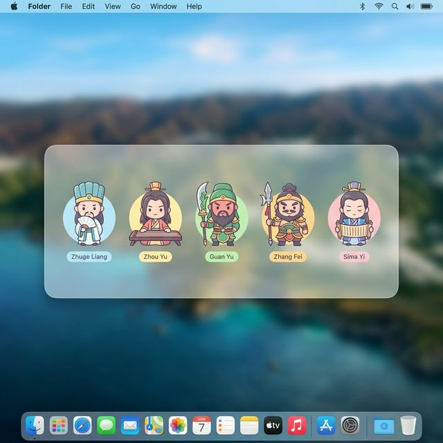
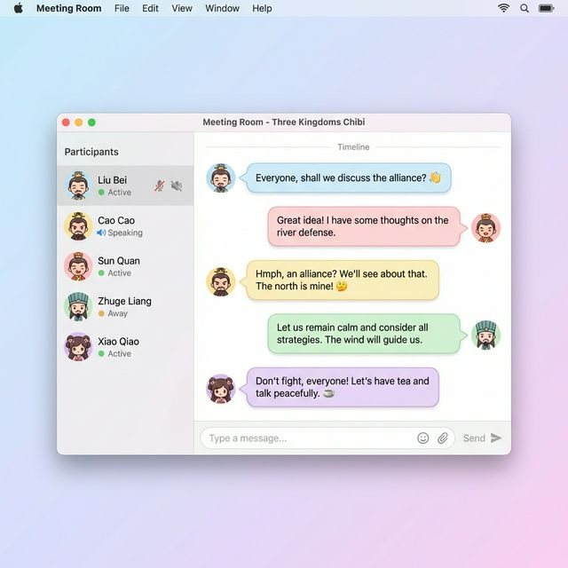
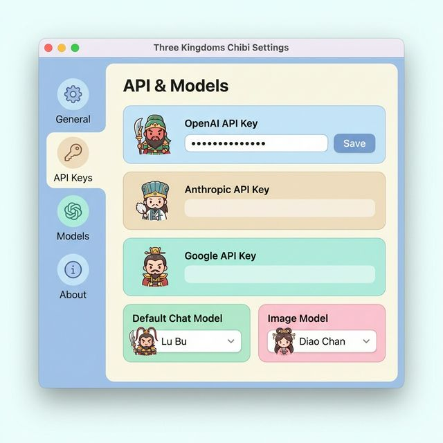

# AI Orchestra

AI Orchestra는 macOS 데스크톱에서 여러 AI 에이전트를 동시에 운영하는 Electron 기반 오케스트레이션 위젯입니다.

## Screenshots






## 주요 기능

- 1:1 채팅: 에이전트별 스트리밍 채팅, 히스토리, 마크다운 렌더링
- 회의실: 다중 AI 턴 기반 토론, 라운드/참석자 설정, 회의 로그
- 에이전트 관리: 추가/수정/삭제/순서 변경, 페르소나 관리
- API 키 설정: Anthropic/OpenAI/Google 키 저장 및 연결 테스트

## 기술 스택

- Electron 34
- Vanilla JavaScript / HTML / CSS
- electron-store
- electron-builder
- 지원 AI: Anthropic Claude, OpenAI GPT, Google Gemini, Ollama

## 설치 및 실행

```bash
npm install
npm start
```

개발 모드(DevTools 포함):

```bash
npm run dev
```

## 빌드

```bash
npm run build
```

현재 빌드 타겟은 macOS `zip`입니다.

## 프로젝트 구조

```text
ai-orchestra/
├── main.js
├── preload.js
├── main/                 # main process modules (IPC, store, window manager, API providers)
├── renderer/             # widget/dashboard/meeting/settings UI
├── config/               # default agents preset
├── docs/screenshots/     # README screenshots
└── tests/                # vitest tests
```

## License

MIT
